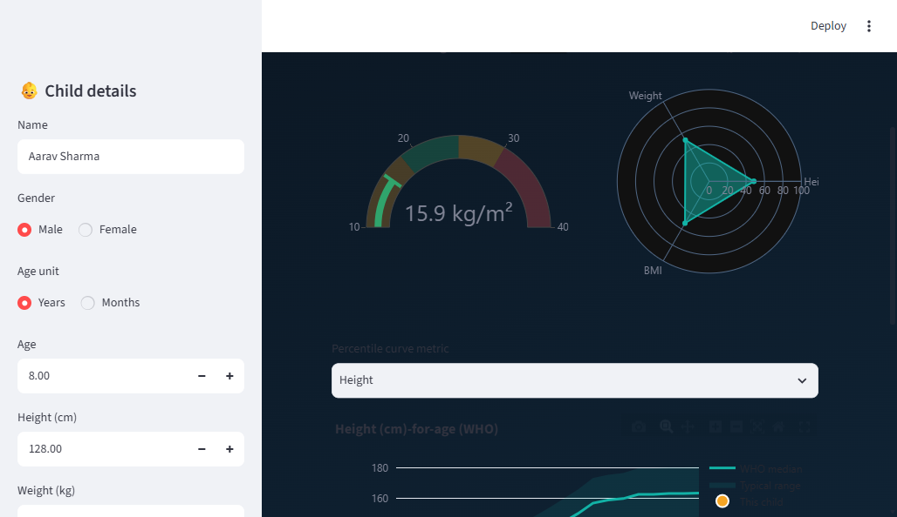

<div align="center">

# 🩺 GrowthAI — AI Health Intelligence Platform

**Growth analysis · AI forecasting · Nutrition intelligence · Risk prediction · Explainable AI · WHO-grounded assistant**

[](https://github.com/prajwal3244/-Growth-and-BMI-Analysis-System-with-Visualization-and-Automated-Report-Generation-/actions/workflows/ci.yml)


*A production-grade evolution of a simple BMI script into an open-source AI healthcare platform for children and young adults (0–20 years).*



</div>

> ⚕️ **Medical disclaimer** — GrowthAI is an **educational decision-support tool, not a medical device**. It does not diagnose or treat. Always consult a qualified paediatrician.

---

## ✨ What it does

| # | Capability | Highlights |
|---|-----------|-----------|
| 📊 | **Growth analysis** | BMI + **age/gender BMI-for-age z-scores** & percentiles (not naive adult cut-offs) |
| 🔮 | **AI growth forecasting** | RandomForest · GradientBoosting · LinearRegression **compared**; personalized **+6-month / +1-year** height, weight & BMI via percentile-channel tracking |
| 🧠 | **Explainable AI** | Feature importance, confidence scores, plain-language "why", optional SHAP |
| ⚠️ | **Health-risk analysis** | Obesity, underweight, malnutrition, growth delay, lifestyle & **future obesity**, each with a Low/Medium/High score **and an explanation** |
| 🥗 | **Nutrition intelligence** | Calories, macros, water, sleep, exercise, screen-time + a **7-day meal plan**, tuned to BMI status |
| 💬 | **AI health assistant** | **Offline RAG** over WHO/CDC guidelines — works with **zero API keys**; pluggable OpenAI/Gemini adapter |
| 📈 | **Interactive charts** | Plotly gauge, radar, percentile curves, forecast graphs, risk profile |
| 📄 | **Smart reports** | Hospital-grade HTML/PDF with charts, **QR code**, and doctor's-notes section |
| 🌍 | **Multi-standard** | Switch between **WHO · CDC · IAP (Indian)** references at runtime |
| 🔐 | **Multi-user backend** | FastAPI + JWT auth, roles (parent/doctor/admin), patient history, SQLAlchemy (SQLite/Postgres) |

---

## 🏗️ Architecture

Clean, layered architecture — the domain core is framework-free and 100% tested.

```
Interfaces   Streamlit dashboard  ·  FastAPI + Swagger
    │
Services     growth · nutrition · risk · report · chatbot
    │
Domain       core (bmi, z-scores) · ml (forecast, explain) · data (WHO/CDC/IAP) · viz (Plotly)
    │
Infra        SQLAlchemy DB · WHO knowledge base
```

Full diagrams (component, sequence, ER, class) → [docs/ARCHITECTURE.md](docs/ARCHITECTURE.md).
Migration story (what changed & why) → [docs/MIGRATION_PLAN.md](docs/MIGRATION_PLAN.md).

---

## 🚀 Quickstart

### Option A — Docker (everything, incl. PDF + Postgres)
```bash
docker compose up --build
# API      → http://localhost:8000/docs
# Dashboard→ http://localhost:8501
```

### Option B — Local (Python 3.10+)
```bash
python -m venv .venv && source .venv/bin/activate     # Windows: .venv\Scripts\activate
make install-dev          # or: pip install -r requirements.txt && pip install -e .

make run-api              # FastAPI  → http://localhost:8000/docs
make run-dashboard        # Streamlit→ http://localhost:8501
make test                 # 26 tests, ~88% coverage
```

> On Windows, PDF export needs GTK for WeasyPrint; without it, reports fall back to
> fully-styled **HTML** automatically. The Docker image includes the native libs, so PDFs work there.

### Option C — CLI (the classic flow, modernized)
```bash
growthai interactive
growthai analyze --age-months 96 --height 128 --weight 26 --gender M
growthai report  --age-months 96 --height 128 --weight 26 --gender M --name "Aarav"
```

---

## 🔌 API examples

```bash
# Full analysis (anonymous, no auth needed)
curl -X POST http://localhost:8000/analysis -H "Content-Type: application/json" \
  -d '{"age_months":96,"height_cm":128,"weight_kg":26,"gender":"M","standard":"WHO"}'

# Ask the WHO-grounded assistant
curl -X POST http://localhost:8000/chat -H "Content-Type: application/json" \
  -d '{"question":"What foods increase height?"}'
```

Interactive Swagger UI at **`/docs`**, ReDoc at **`/redoc`**.

---

## 🧪 Quality

- **26 tests** (unit + integration + API) · **~88% coverage** · ruff-linted
- CI on Python **3.10 / 3.11 / 3.12** + Docker build (GitHub Actions)
- Type hints, structured logging, typed config, custom exception hierarchy

```bash
make test   # pytest --cov=growthai
make lint   # ruff check src tests
```

---

## 📂 Project structure

```
src/growthai/
├── core/         # domain: bmi, z-scores, enums, exceptions   (framework-free)
├── data/         # WHO/CDC/IAP reference-data engine
├── ml/           # forecasting, model comparison, explainability
├── services/     # growth · nutrition · risk · report orchestration
├── viz/          # Plotly charts
├── chatbot/      # offline RAG + pluggable LLM providers + WHO KB
├── reports/      # Jinja2 templates + HTML/PDF renderer
├── db/           # SQLAlchemy models, session
├── api/          # FastAPI app, JWT auth, routers, schemas
└── cli.py        # command-line interface
frontend/         # Streamlit dashboard
datasets/         # WHO growth reference CSVs
tests/            # pytest suite
docs/             # architecture, migration plan, roadmap
legacy/           # the original GrowthInsight.py, preserved
```

---

## 🗺️ Roadmap

React frontend · real WHO LMS percentile tables · wearable/IoT integration · mobile app · full accessibility. See [docs/ROADMAP.md](docs/ROADMAP.md).

## 🤝 Contributing

PRs welcome — see [CONTRIBUTING.md](CONTRIBUTING.md). Licensed under [MIT](LICENSE).

---

<div align="center">
Built as a flagship open-source healthcare-AI portfolio project · Educational use only.
</div>
