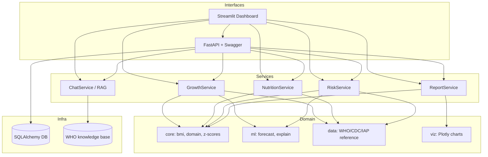
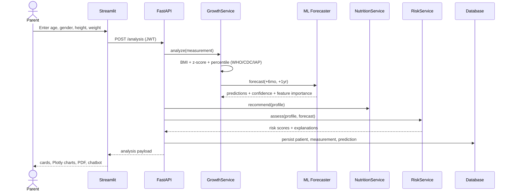
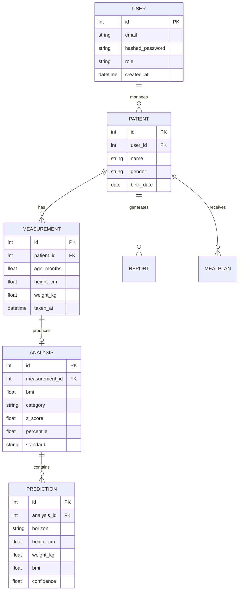
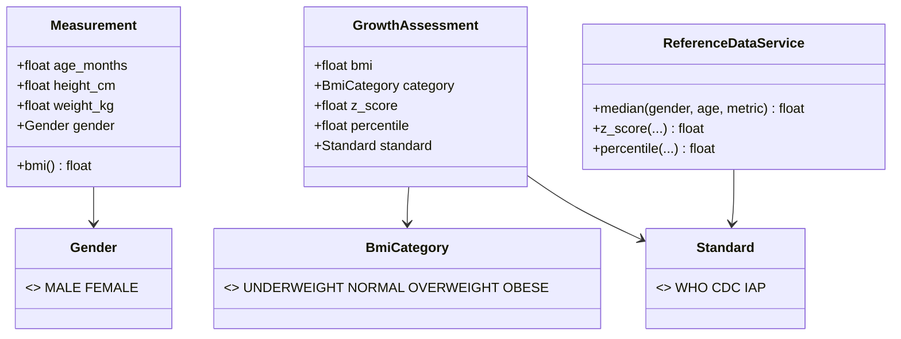

# Architecture

GrowthAI is a layered **Clean Architecture** application. Diagrams below use Mermaid and
render natively on GitHub.

## Component / container diagram

## Sequence — full analysis request

## Entity-Relationship diagram

## Class diagram — domain core

## Technology choices

| Concern | Choice | Rationale |
| --- | --- | --- |
| Backend | FastAPI + Pydantic v2 | Async, typed, auto Swagger, industry standard |
| ORM | SQLAlchemy 2.0 | Works with SQLite (dev) and Postgres (prod) |
| ML | scikit-learn | RF/GBR/LinReg, transparent, no GPU needed |
| Explainability | feature importance + optional SHAP | Trust & transparency for health predictions |
| Charts | Plotly | Interactive, exportable, embeds in web + PDF |
| Dashboard | Streamlit | Fast, pure-Python, ideal for ML/health UIs |
| Chatbot | LangChain-style offline RAG | Works with zero API keys; pluggable LLM |
| Reports | Jinja2 + WeasyPrint | Preserves original pipeline, upgraded template |
| Auth | JWT (python-jose) + passlib | Stateless, standard |
| Packaging | pyproject (PEP 621) | Installable `pip install -e .` |
| Delivery | Docker, docker-compose, GitHub Actions | One-command run, CI on every push |
